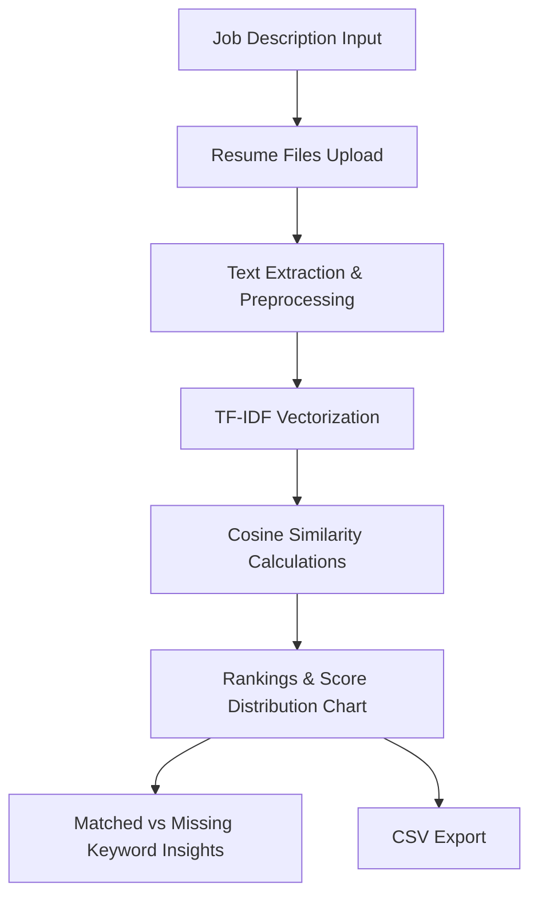

# 🤖 Intelligent Resume Ranking System 💼

An advanced, feature-rich Python web application designed to automatically parse, evaluate, and rank candidate resumes against specific job descriptions. Using Natural Language Processing (NLP) techniques, TF-IDF Vectorization, and Cosine Similarity, the system provides recruiting teams with data-driven insights to find the best talent efficiently.

---

## 🌟 Key Features

*   **Multi-Format Resume Parser**: Effortlessly reads and extracts text from `.pdf` (via `pypdf`), `.docx` (via `python-docx`), and `.txt` files.
*   **Smart Contact Info Extraction**: Employs robust regex patterns to automatically parse candidate email addresses and phone numbers.
*   **Prevent Keyword Stuffing**: Utilizes logarithmic term scaling (`sublinear_tf=True` in TF-IDF Vectorizer) so candidates cannot artificially inflate their ranking scores by repeating keywords.
*   **Programming Symbol Preservation**: Features custom tokenizer patterns to preserve essential technical keywords like `C++`, `C#`, `.NET`, and `Node.js` that standard tokenizers strip away.
*   **Interactive Visualizations**: Renders rich Plotly charts showing score distributions and candidate comparisons.
*   **Skill Gap Analysis**: Shows exact matched and missing keywords for any selected candidate, highlighting strengths and missing requirements.
*   **Data Export**: Allows downloading full results in CSV format for seamless integration with ATS (Applicant Tracking Systems).

---

## 🛠️ Tech Stack & Libraries

*   **Frontend & UI**: [Streamlit](https://streamlit.io/) — for a clean, responsive web application interface.
*   **NLP & Vectorization**: [Scikit-learn](https://scikit-learn.org/) — specifically `TfidfVectorizer` for term weighting and cosine similarity.
*   **File Parsing**: `pypdf` (for PDF files) and `python-docx` (for Word documents).
*   **Data Analysis**: `pandas` & `numpy`.
*   **Data Visualization**: `Plotly` — for dynamic interactive charts.

---

## 📈 System Flow & Pipeline



---

## 🚀 Installation & Setup Guide

Follow these step-by-step instructions to get the application running on your local machine.

### 📋 Prerequisites
Make sure you have the following installed on your system:
*   [Python 3.8 or higher](https://www.python.org/downloads/)
*   [Git](https://git-scm.com/downloads)

---

### 💻 Step-by-Step Installation

#### 1. Clone the Repository
Open your terminal (macOS/Linux) or Command Prompt/PowerShell (Windows) and run:
```bash
git clone https://github.com/Uttkarsh55/Intelligent-Resume-Ranking-System.git
cd Intelligent-Resume-Ranking-System
```

#### 2. Set Up a Virtual Environment
It is highly recommended to use a virtual environment to avoid dependency conflicts.

*   **macOS / Linux**:
    ```bash
    python3 -m venv .venv
    ```
*   **Windows**:
    ```bash
    python -m venv .venv
    ```

#### 3. Activate the Virtual Environment
Activate the environment you just created.

*   **macOS / Linux**:
    ```bash
    source .venv/bin/activate
    ```
*   **Windows (Command Prompt)**:
    ```bash
    .venv\Scripts\activate.bat
    ```
*   **Windows (PowerShell)**:
    ```bash
    .\.venv\Scripts\Activate.ps1
    ```

#### 4. Install Required Dependencies
Once the virtual environment is active, upgrade `pip` and install all the project requirements:
```bash
pip install --upgrade pip
pip install -r requirements.txt
```

---

### 🏃 Running the Application

To launch the web interface, run the following command in your terminal (with the virtual environment still active):
```bash
streamlit run app.py
```

This will automatically open the application in your default web browser. If it doesn't, navigate to the local URL shown in your terminal (usually `http://localhost:8501`).

---

### ⚡ Automated Windows Setup (Alternative)
If you are on Windows, you can automate virtual environment creation and package installation by simply double-clicking the `setup.bat` file in the project folder. Once the script finishes, run:
```bash
.venv\Scripts\activate
streamlit run app.py
```

---

## 📂 Project Structure

```text
├── app.py                # Multi-step Streamlit UI, wizard flows & visualizations
├── resume_parser.py      # Core parser for file extraction (PDF, DOCX, TXT) and contact info regex
├── ranker.py             # Pre-processing, custom tokenization, TF-IDF and similarity formulas
├── requirements.txt      # Python dependencies
├── setup.bat             # Automated environment installer script for Windows
├── README.md             # Project documentation
└── sample_data/          # Bundled sample inputs for demonstration
    ├── job_descriptions/ # Sample job requirements (.txt files)
    └── resumes/          # Realistic candidate resumes (.pdf files)
```
