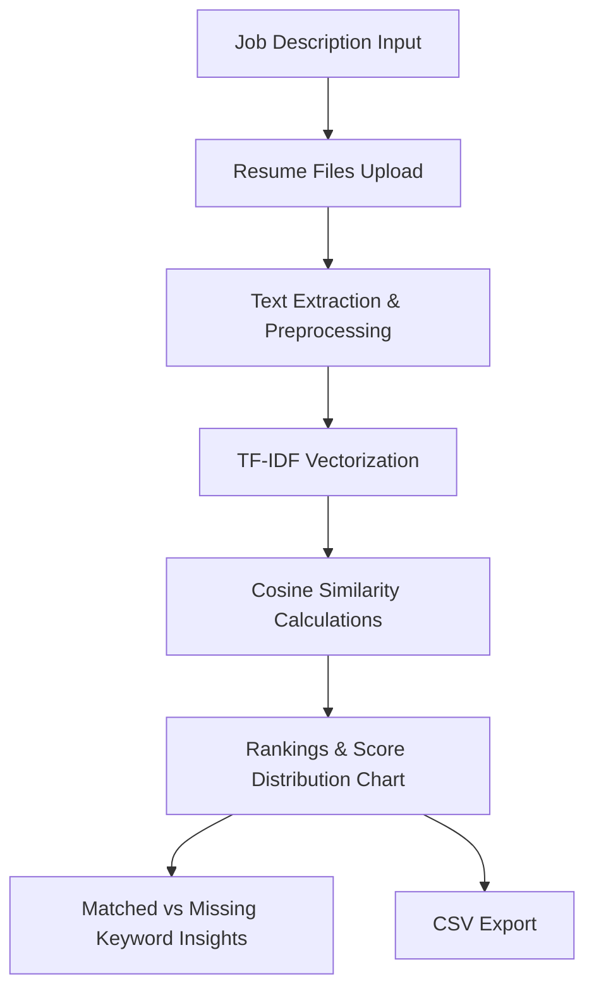

# 🤖 Intelligent Resume Ranking System 💼

An advanced, feature-rich Python web application designed to automatically parse, evaluate, and rank candidate resumes against specific job descriptions. Using Natural Language Processing (NLP) techniques, TF-IDF Vectorization, and Cosine Similarity, the system provides recruiting teams with data-driven insights to find the best talent efficiently.

---

## 🌟 Key Features

*   **Multi-Format Resume Parser**: Effortlessly reads and extracts text from `.pdf` (via `pypdf`), `.docx` (via `python-docx`), and `.txt` files.
*   **Smart Contact Info Extraction**: Employs robust regex patterns to automatically parse candidate email addresses and phone numbers.
*   **Prevent Keyword Stuffing**: Utilizes logarithmic term scaling (`sublinear_tf=True` in TF-IDF Vectorizer) so candidates cannot artificially inflate their ranking scores by repeating keywords.
*   **Programming Symbol Preservation**: Features custom tokenizer patterns to preserve essential technical keywords like `C++`, `C#`, `.NET`, and `Node.js` that standard tokenizers strip away.
*   **Interactive Visualizations**: Renders rich Plotly charts showing score distributions and candidate comparisons.
*   **Skill Gap Analysis**: Shows exact matched and missing keywords for any selected candidate, highlighting strengths and missing requirements.
*   **Data Export**: Allows downloading full results in CSV format for seamless integration with ATS (Applicant Tracking Systems).

---

## 🛠️ Tech Stack & Libraries

*   **Frontend & UI**: [Streamlit](https://streamlit.io/) — for a clean, responsive web application interface.
*   **NLP & Vectorization**: [Scikit-learn](https://scikit-learn.org/) — specifically `TfidfVectorizer` for term weighting and cosine similarity.
*   **File Parsing**: `pypdf` (for PDF files) and `python-docx` (for Word documents).
*   **Data Analysis**: `pandas` & `numpy`.
*   **Data Visualization**: `Plotly` — for dynamic interactive charts.

---

## 📈 System Flow & Pipeline



---

## 🚀 Setup & Execution Instructions

### ⚡ Automated Setup (Windows Only)
1. Double-click the `setup.bat` script.
2. The script will automatically create a Python virtual environment (`.venv`), upgrade `pip`, install all dependencies, and prepare project folders.
3. Once completed, activate the virtual environment and run the application:
   ```bash
   .venv\Scripts\activate
   streamlit run app.py
   ```

---

### 🛠️ Manual Setup (macOS / Linux / Windows)

#### 1. Clone & Navigate to Repository
```bash
git clone <your-repository-url>
cd "Intelligent Resume Ranking"
```

#### 2. Create a Virtual Environment
```bash
# macOS/Linux
python3 -m venv .venv

# Windows
python -m venv .venv
```

#### 3. Activate the Virtual Environment
```bash
# macOS/Linux
source .venv/bin/activate

# Windows (Command Prompt)
.venv\Scripts\activate.bat

# Windows (PowerShell)
.\.venv\Scripts\Activate.ps1
```

#### 4. Install Dependencies
```bash
pip install --upgrade pip
pip install -r requirements.txt
```

#### 5. Run the Application
```bash
streamlit run app.py
```

---

## 📂 Project Structure

```text
├── app.py                # Multi-step Streamlit UI, wizard flows & visualizations
├── resume_parser.py      # Core parser for file extraction (PDF, DOCX, TXT) and contact info regex
├── ranker.py             # Pre-processing, custom tokenization, TF-IDF and similarity formulas
├── requirements.txt      # Python dependencies
├── setup.bat             # Automated environment installer script for Windows
├── README.md             # Project documentation
└── sample_data/          # Bundled sample inputs for demonstration
    ├── job_descriptions/ # Sample job requirements (.txt files)
    └── resumes/          # Realistic candidate resumes (.pdf files)
```

---
