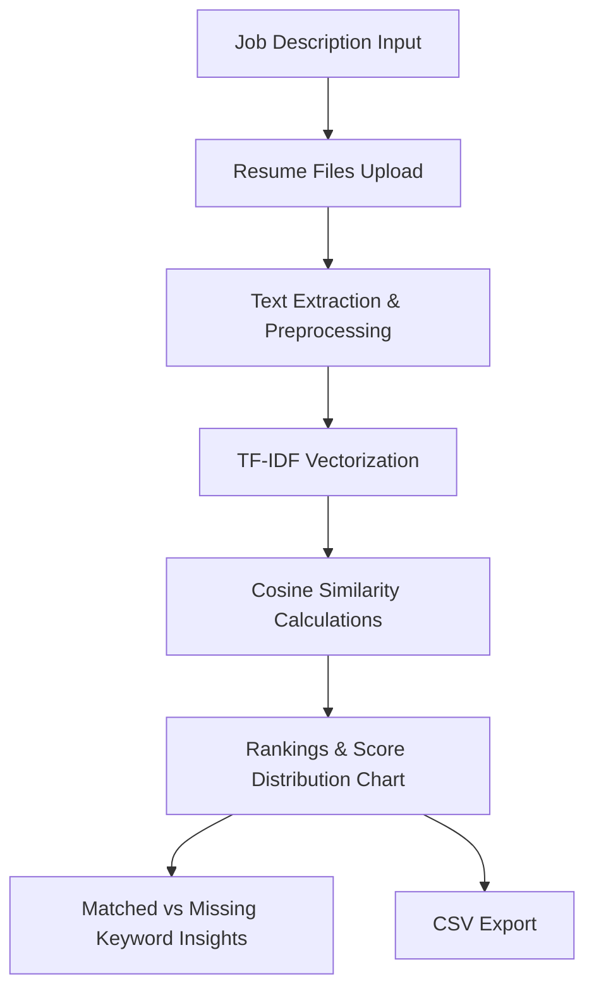

# Resume Ranker 💼

A professional, minimalist Python web application designed to evaluate and rank candidate resumes against a job description. 

Built using **Python**, **Streamlit**, **Scikit-learn (TF-IDF)**, and **Plotly**.

---

## 🛠️ Key Pipeline Components

- **Multi-Format Parser**: Extracts text from `.pdf` (via `pypdf`), `.docx` (via `python-docx`), and `.txt` resumes.
- **Smart Contact Parser**: Extracts candidate emails and phone numbers using robust regular expression patterns.
- **Technical Keyword Extraction**: Identifies the top 15 terms in the Job Description based on TF-IDF weight to perform a candidate skill-gap analysis.
- **Logarithmic Term Scaling**: Utilizes `sublinear_tf=True` in the TF-IDF Vectorizer to prevent candidates from inflating their relevance scores by keyword stuffing.
- **Cosine Similarity Scoring**: Calculates the mathematical cosine similarity between the Job Description term vector and each resume vector to produce an accurate ranking list.

---

## 📈 System Flow



---

## 🚀 Setup & Execution Instructions

### Automated Virtual Environment Setup (Windows)
1. Double-click the `setup.bat` script.
2. This script will automatically create a Python virtual environment (`.venv`), upgrade `pip`, install all dependencies, and prepare the folder structure.
3. Once completed, activate the virtual environment and run the application:
   ```bash
   .venv\Scripts\activate
   streamlit run app.py
   ```

### Manual Setup (macOS / Linux / Windows)
1. **Clone the Repository**:
   ```bash
   git clone <your-repository-url>
   cd "campus pull task"
   ```
2. **Create a Virtual Environment**:
   ```bash
   python -m venv .venv
   ```
3. **Activate the Virtual Environment**:
   - **Windows (cmd)**: `.venv\Scripts\activate.bat`
   - **Windows (PowerShell)**: `.\.venv\Scripts\Activate.ps1`
   - **macOS/Linux**: `source .venv/bin/activate`
4. **Install Dependencies**:
   ```bash
   pip install --upgrade pip
   pip install -r requirements.txt
   ```
5. **Start the Web App**:
   ```bash
   streamlit run app.py
   ```

---

## 📂 Project Structure
```text
├── app.py                # Multi-step Streamlit wizard app & visualizations
├── resume_parser.py      # Resume file reader (PDF, DOCX, TXT) & regex parsers
├── ranker.py             # Pre-processing, TF-IDF, and similarity calculations
├── requirements.txt      # List of dependencies
├── setup.bat             # Automated environment setup script for Windows
├── README.md             # Project documentation
└── sample_data/          # Folder structures for sample files
    ├── job_descriptions/
    └── resumes/
```

---

## 📽️ Demo Video Guide (3-5 Minutes)
Use the outline below to record your submission video. It is designed to match the submission rubric perfectly:

### 1. Introduction (0:00 - 0:45)
- Introduce yourself, the position (AI Intern at CampusPull), and the goal of the project.
- Launch the Streamlit application and show the Step 1 (Job Description) interface.

### 2. Project Architecture & Tech Stack (0:45 - 1:30)
- Explain the multi-step system pipeline: Job Description input -> Resumes Upload -> Text Extraction & NLP Cleaning -> TF-IDF Vectorization -> Cosine Similarity.
- Mention the libraries used: `pypdf`, `python-docx`, `scikit-learn`, `plotly`.

### 3. Code Walkthrough (1:30 - 2:30)
- Show `resume_parser.py`: Explain how text is parsed from PDFs/DOCXs, and how candidate email/phone is extracted using regex.
- Show `ranker.py`: Explain the text cleaning (preserving `C++`/`C#`), the custom token pattern to keep special characters, and `sublinear_tf=True` to prevent keyword spammers from dominating.

### 4. Live Demonstration (2:30 - 3:45)
- **Step 1**: Paste the sample Job Description and click "Continue".
- **Step 2**: Upload the mock resumes (from the `sample_data/resumes/` folder) and click "Analyze & Rank".
- **Step 3**: Walk through the ranked list. Show the Plotly score distribution chart.
- Select a candidate to demonstrate the matched vs. missing keywords (gap analysis).
- Click "Export Results (CSV)" to show the data output.

### 5. Challenges Faced & Learnings (3:45 - 5:00)
- **Tokenization of Special Characters**: Standard tokenizers strip symbols in developer skills like `C++` and `C#`. *Solution*: Custom regex token patterns and bounds check.
- **Logarithmic TF Scaling**: Candidates spamming keywords can skew ranking. *Solution*: Utilized `sublinear_tf=True` to scale frequency logarithmically.
